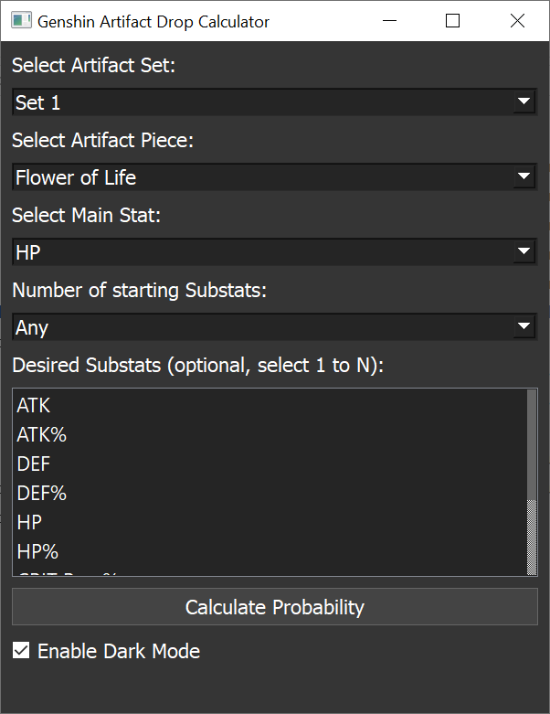

# Genshin Artifact Drop Calculator

A **PyQt5-based GUI tool** for calculating artifact drop probabilities and expected runs in **Genshin Impact**.  
Determine how many runs you need for your desired artifact piece, main stat, and substats.

---

## Features
- Select **Artifact Set**, **Piece**, and **Main Stat**
- Flexible **Substat requirements**:
  - Any substats
  - Minimum number of specific substats (1 to N)
- Calculates:
  - **Probability of drop**
  - **Expected runs**
- **Detailed breakdown** of calculation steps
- **Dark Mode / Light Mode toggle**

---

## Screenshots
### Light Mode


### Dark Mode


*(no screenshots yet...)*

---

## Installation (Python Version)
### 1. Clone the repository
```bash
git clone https://github.com/ryoukif/genshin-artifact-drop-calculator.git
cd genshin-artifact-drop-calculator
```

### 2. Install dependencies
```bash
pip install -r requirements.txt
```

`requirements.txt` contains:
```
PyQt5
```

### 3. Run the app
```bash
python artifact_drop_calculator.py
```

---

## 🚀 Download Pre-Built EXE (Windows)
If you don't want to install Python, download the **standalone EXE** from the latest release:

[**Download Latest Release**](https://github.com/ryoukif/genshin-artifact-drop-calculator/releases/latest)

The EXE was created with **PyInstaller** (`--onefile` mode) and runs without any additional installation.

---


## Future Features
- Export calculation details to TXT
- Copy-to-clipboard button for sharing builds
- Optional graphical probability chart

---

## Requirements
- Python **3.8+**
- PyQt5

---

## License
MIT License – feel free to use and modify.

---

## Contributing
Pull requests are welcome! If you find issues, please open an [issue](https://github.com/ryoukif/genshin-artifact-drop-calculator/issues).
